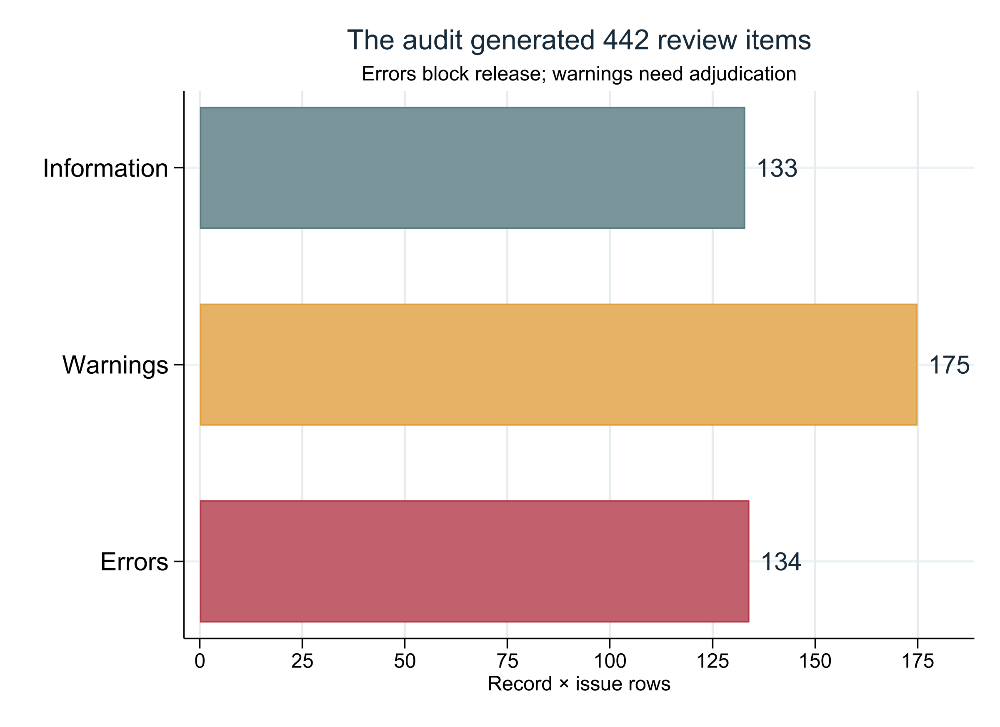
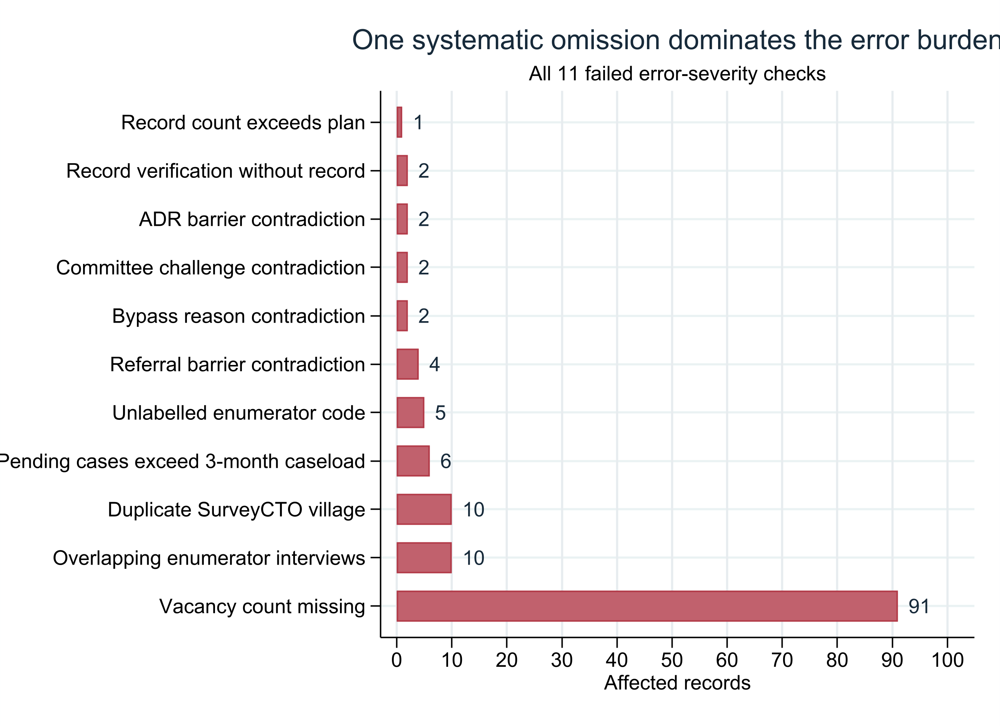
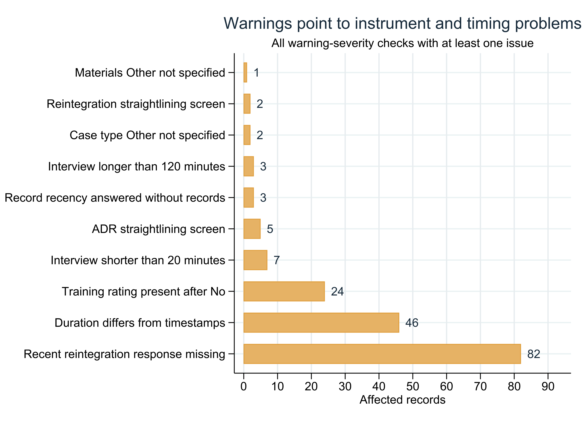
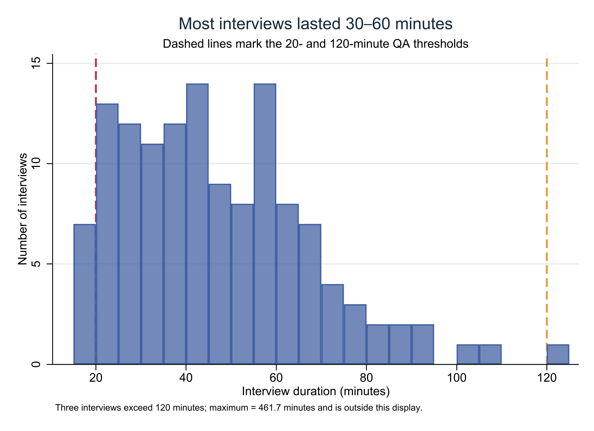
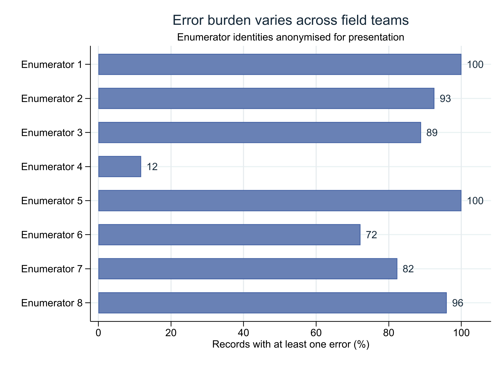
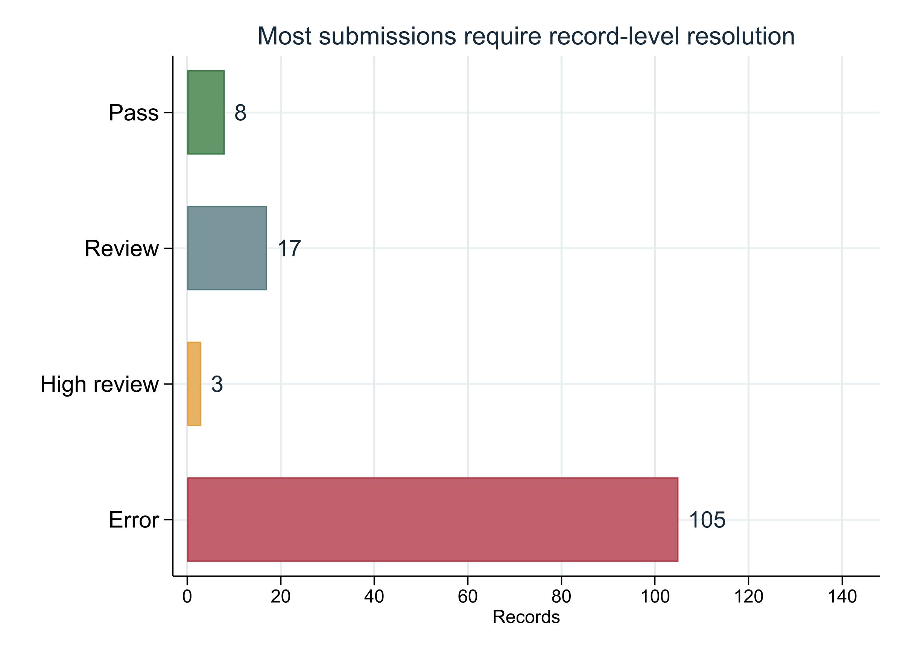
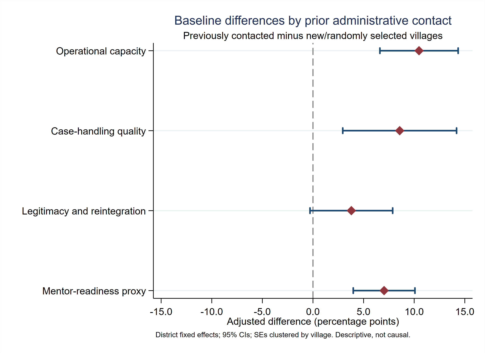

## The baseline is not ready for analytical release

::: {.columns}
::: {.column width="46%"}
<div class="status-blocked">BLOCKED</div>

The automated release gate found unresolved error-severity conditions.

<div class="plain-meaning"><strong>Plain meaning:</strong> preserve the data, resolve or adjudicate the flagged records, and rerun before publishing baseline findings.</div>
:::

::: {.column width="54%"}
<div class="metric-line">
  <div><div class="kpi red">11</div><div class="kpi-label">failed error checks</div></div>
  <div><div class="kpi red">105</div><div class="kpi-label">records with ≥1 error</div></div>
</div>

<div class="metric-line">
  <div><div class="kpi amber">5</div><div class="kpi-label">extra submissions</div></div>
  <div><div class="kpi blue">128</div><div class="kpi-label">unique village keys</div></div>
</div>
:::
:::

<div class="source-note">Source: Stata QA release gate and record flags, run 16 July 2026.</div>

## The audit separates repairable errors from structural risks

<div class="flowline">
  <div class="stage">Raw SurveyCTO export</div><div class="arrow">→</div>
  <div class="stage">Cleaned baseline</div><div class="arrow">→</div>
  <div class="stage">Record logic</div><div class="arrow">→</div>
  <div class="stage">Fieldwork paradata</div><div class="arrow">→</div>
  <div class="stage">Analysis outputs</div>
</div>

::: {.columns}
::: {.column width="50%"}
- Raw-to-clean record and key lineage
- Exact value-label and numeric-range validation
- Consent, IDs, duplicates, and sample structure
- Skip logic and select-multiple contradictions
:::

::: {.column width="50%"}
- Interview dates, duration, and overlaps
- Module response density and missing indices
- District and anonymised field-team monitoring
- Regression outputs linked to the audited file
:::
:::

<div class="good-note"><strong>Design principle:</strong> the pipeline never overwrites source responses. It records issues, assigns severity, and makes release status explicit.</div>

## Five extra submissions explain the sample overrun

<div class="metric-line">
  <div><div class="kpi red">133</div><div class="kpi-label">submitted records</div></div>
  <div><div class="kpi blue">128</div><div class="kpi-label">planned village sample</div></div>
  <div><div class="kpi green">128</div><div class="kpi-label">unique village keys observed</div></div>
</div>

<div class="big-statement centered">133 submissions − 128 unique village keys = <span class="negative">5 extra submissions</span></div>

<div class="plain-meaning">The sample reached the intended number of unique village keys, but five keys appear twice. Ten records are therefore part of duplicated village pairs and need adjudication.</div>

<div class="source-note">Source: survey_village_uid duplicate check and expected sample-count checks.</div>

## Raw-to-clean lineage is intact

::: {.columns}
::: {.column width="42%"}
<div class="kpi green">20 / 20</div>
<div class="kpi-label">lineage checks passed</div>

<div class="kpi green" style="margin-top:42px;">0</div>
<div class="kpi-label">raw-to-clean lineage failures</div>
:::

::: {.column width="58%"}
| Lineage question | Result |
|---|---:|
| Same number of raw and cleaned records? | **Pass** |
| Any raw submission key lost? | **No** |
| Any cleaned key absent from raw export? | **No** |
| Duplicate or missing raw keys? | **No** |
| Consent, enumerator, geography, and duration preserved? | **Yes** |
:::
:::

<div class="good-note"><strong>What this rules out:</strong> the main release problem is not record loss during cleaning. It is concentrated in fielded responses, sample identity, and paradata.</div>

## Errors are concentrated, not evenly distributed

::: {.columns}
::: {.column width="72%"}
{fig-alt="Horizontal bars show 134 errors, 175 warnings, and 133 informational issue rows." width="100%"}
:::

::: {.column width="28%"}
<div class="kpi red">442</div>
<div class="kpi-label">record × issue rows</div>

<div class="plain-meaning"><strong>One issue row</strong> is one record failing one check. It is not one respondent and not one unique data problem.</div>
:::
:::

<div class="source-note">Source: phase1_baseline_dq_issues.dta. Counts can overlap across records.</div>

## One missing follow-up drives most blocking errors

{fig-alt="Bar chart of all failed error checks. Vacancy count missing affects 91 records and dominates other checks." width="92%"}

<div class="risk-note"><strong>91 records:</strong> respondents reported committee vacancies, but the follow-up count was missing or zero. This is systematic enough to investigate questionnaire routing or fielding—not simply drop 91 records.</div>

## Sample identity needs adjudication, not deletion

::: {.columns}
::: {.column width="50%"}
### Duplicate village keys

- **5** duplicated village keys
- **10** records belong to duplicate pairs
- The duplicates account for the full gap between 133 submissions and 128 unique keys

<div class="risk-note">Do not keep the “first” record mechanically. Use submission timestamps, enumerator notes, replacement records, and actual village verification.</div>
:::

::: {.column width="50%"}
### Sampling-frame linkage

- **133** records did not match the original randomized sampling frame
- This is classified as **information**, not a raw-lineage error
- The cleaning code already notes that replacement-village corrections require a record-level mapping

<div class="plain-meaning">Complete the submission-key → actual-village crosswalk, then rerun the merge and duplicate checks.</div>
:::
:::

## Warnings reveal instrument and timing problems

{fig-alt="Bar chart of warning checks. Reintegration response missing affects 82 records, duration timestamp mismatch affects 46, and training rating routing affects 24." width="92%"}

<div class="plain-meaning"><strong>Two likely programming signals:</strong> 82 missing reintegration follow-ups and 24 training ratings populated after a No response. Both should be checked against the deployed form and skip logic.</div>

## Most interviews lasted 30–60 minutes

::: {.columns}
::: {.column width="72%"}
{fig-alt="Histogram of interview duration, concentrated between 30 and 60 minutes, with quality thresholds at 20 and 120 minutes." width="100%"}
:::

::: {.column width="28%"}
<div class="kpi blue">44.6</div><div class="kpi-label">median minutes</div>

<div class="kpi red" style="margin-top:26px;">7</div><div class="kpi-label">under 20 minutes</div>

<div class="kpi amber" style="margin-top:26px;">3</div><div class="kpi-label">over 120 minutes</div>

<div class="kpi-label" style="margin-top:26px;">Maximum: <strong>461.7 minutes</strong></div>
:::
:::

<div class="source-note">46 records also differ from start-to-end elapsed time by more than five minutes. Review pauses, device behavior, and timestamp construction before classifying them as invalid.</div>

## Field-team patterns guide targeted review

::: {.columns}
::: {.column width="70%"}
{fig-alt="Anonymised field-team chart showing the share of each enumerator's records with an error, ranging from 12 to 100 percent." width="100%"}
:::

::: {.column width="30%"}
- **10** interview overlaps were detected
- Error-record shares range from **12% to 100%**
- Team identities are anonymised here

<div class="plain-meaning">Use this to target back-checks—not to rank staff. The dominant vacancy-count issue may reflect form routing rather than individual performance.</div>
:::
:::

## The error burden is widespread across districts

| District | Records | Records with error | Error-record share | Mean duration |
|---|---:|---:|---:|---:|
| Bushenyi | 55 | 44 | **80.0%** | 62.9 min |
| Rubirizi | 42 | 33 | **78.6%** | 49.0 min |
| Sheema | 36 | 28 | **77.8%** | 36.0 min |

<div class="big-statement">The release problem is <span class="negative">not confined to one district</span>.</div>

<div class="plain-meaning">Similar error rates across districts reinforce the case for investigating systematic questionnaire and processing rules before focusing on local field performance.</div>

## Only eight records pass every automated screen

::: {.columns}
::: {.column width="72%"}
{fig-alt="Horizontal bars show 105 records with an error, 3 high review, 17 review, and 8 pass." width="100%"}
:::

::: {.column width="28%"}
<div class="kpi red">105</div><div class="kpi-label">error priority</div>

<div class="kpi amber" style="margin-top:24px;">3</div><div class="kpi-label">high review</div>

<div class="kpi blue" style="margin-top:24px;">17</div><div class="kpi-label">review</div>

<div class="kpi green" style="margin-top:24px;">8</div><div class="kpi-label">pass</div>
:::
:::

<div class="source-note">Priority is conservative: an information-only sampling-frame item does not itself move a record out of Pass.</div>

## Four actions can move the release gate to READY

::: {.columns}
::: {.column width="50%"}
### 1. Resolve sample identity

Adjudicate five duplicated village keys and complete the actual-village crosswalk.

### 2. Audit form routing

Trace the 91 missing vacancy counts and 82 missing reintegration follow-ups to the deployed questionnaire.
:::

::: {.column width="50%"}
### 3. Review paradata

Investigate 10 overlaps, 46 duration mismatches, seven short interviews, and three long interviews.

### 4. Rerun and document

Record each decision, rerun cleaning and QA, and require zero unresolved error checks before release.
:::
:::

<div class="good-note"><strong>Release standard:</strong> no unresolved errors; warnings either corrected or documented with a defensible adjudication rule.</div>

## What the provisional regressions can—and cannot—say {.section-break background-color="#172A3A"}

The current models reveal baseline selection differences. They do not estimate the effect of training.

## Were previously contacted villages different at baseline?

::: {.columns}
::: {.column width="55%"}
### Plain-language model

For each 0–1 outcome index, compare previously contacted villages with new/randomly selected villages while holding district constant.

The focal coefficient is the adjusted difference in **percentage points**.

### Four outcomes

Operational capacity · case-handling quality · legitimacy/reintegration · mentor readiness
:::

::: {.column width="45%"}
### Technical specification

```stata
regress outcome ///
    i.p1_admin_previously_contacted ///
    i.regression_district_id, ///
    vce(cluster survey_village_id)
```

- **N = 133** submissions
- **128** village clusters
- District fixed effects
- Cluster-robust standard errors
:::
:::

<div class="risk-note">These models use the pre-adjudication file. They are presented as provisional descriptive evidence only.</div>

## Previously contacted villages score higher on three outcomes

{fig-alt="Coefficient plot showing positive adjusted baseline differences for previously contacted villages across operational capacity, case handling, legitimacy, and mentor readiness." width="92%"}

<div class="source-note">Diamonds are district-adjusted differences; lines are 95% confidence intervals. Standard errors are clustered by village.</div>

## Operational capacity shows the largest adjusted gap

::: {.regression-table}
| Outcome | New mean | Previously contacted mean | Adjusted gap | 95% CI | p-value |
|---|---:|---:|---:|---:|---:|
| Operational capacity | 0.696 | 0.803 | **+10.5 pp** | 6.6 to 14.3 | <0.001 |
| Case-handling quality | 0.644 | 0.729 | **+8.6 pp** | 2.9 to 14.2 | 0.003 |
| Legitimacy and reintegration | 0.592 | 0.633 | +3.8 pp | −0.3 to 7.9 | 0.069 |
| Mentor-readiness proxy | 0.641 | 0.712 | **+7.0 pp** | 4.0 to 10.1 | <0.001 |
:::

<div class="plain-meaning">Previously contacted villages enter Phase 1 with higher measured capacity and readiness. The legitimacy gap is positive but does not exclude zero at the 5% level.</div>

## These are selection signals, not program impacts

::: {.columns}
::: {.column width="48%"}
<div class="kpi red">Not causal</div>

- Contact status predates the current Phase 1 analysis
- The groups differ at baseline
- Unresolved duplicates and QA flags remain
- District adjustment cannot remove all selection differences
:::

::: {.column width="52%"}
<div class="big-statement" style="margin-top:22px;">The safe conclusion is:</div>

<div class="plain-meaning">Previously contacted villages were measurably different at baseline. Future comparisons should preserve and adjust for origin status.</div>

<div class="risk-note">Do not describe these coefficients as the effect of CDFU, FHRI, or the current training programme.</div>
:::
:::

## Use a guarded analysis protocol after QA resolution

1. **Freeze the adjudicated sample** and document which duplicate submission is retained.
2. **Preserve administrative origin** in every analytical file and baseline table.
3. **Report new and previously contacted villages separately** before presenting pooled estimates.
4. **Adjust or stratify by origin and district** in outcome models where appropriate.
5. **Cluster at the true assignment or sampling unit**, using the corrected village identifier.
6. **Label baseline regressions descriptive**; reserve causal language for the later evaluation design.

<div class="good-note">The regression pipeline can be rerun unchanged after the record and village corrections are finalized.</div>

## Every number has a reproducible evidence chain

<div class="flowline">
  <div class="stage">Raw XLSX</div><div class="arrow">→</div>
  <div class="stage">Clean DTA</div><div class="arrow">→</div>
  <div class="stage">QA DTA / CSV</div><div class="arrow">→</div>
  <div class="stage">Stata figures</div><div class="arrow">→</div>
  <div class="stage">Quarto deck</div>
</div>

::: {.technical}
- QA engine: `3 Baseline Data Quality_AdvJusticeUganda.do`
- Regression engine: `4 Key Baseline Regressions_AdvJusticeUganda.do`
- Presentation assets: `5 QA Presentation Assets_AdvJusticeUganda.do`
- QA report: `phase1_baseline_dq_report.xlsx`
- Regression log: `key_baseline_regressions.log`
- Presentation source: `phase1_baseline_qa_presentation.qmd`
:::

<div class="source-note">All figures in this deck are generated from Stata outputs. No values were manually recalculated for presentation.</div>

## Approve remediation first; approve release after rerun

::: {.columns}
::: {.column width="60%"}
<div class="big-statement" style="margin-top:30px;">The baseline is analytically promising, but the evidence chain is not yet release-ready.</div>

<div class="risk-note"><strong>Decision now:</strong> keep the release blocked and authorize the four-part remediation sequence.</div>

<div class="good-note"><strong>Decision after rerun:</strong> approve release only when error checks are cleared and warning adjudications are documented.</div>
:::

::: {.column width="40%"}
<div class="status-blocked" style="font-size:70px; margin-top:55px;">BLOCKED</div>

<div class="kpi-label">Current status</div>

<div style="margin-top:80px;" class="status-ready">READY</div>

<div class="kpi-label">Target status</div>
:::
:::

## Appendix: severity rules

| Severity | What it means | Release implication |
|---|---|---|
| **Error** | A required field, identity, range, logic, or sample condition failed | Blocks release until corrected or explicitly adjudicated |
| **Warning** | Plausibility, missingness, timing, or response-pattern concern | Requires review and documented treatment |
| **Information** | Diagnostic context that may be expected but must be documented | Does not block release by itself |

<div class="plain-meaning">Severity applies to a check. Issue rows count the records affected by that check; one record may appear multiple times.</div>

## Appendix: failed error checks, part 1

::: {.compact-table}
| Check ID | Plain-language issue | Affected records |
|---|---|---:|
| `VACANCY_COUNT_MISSING` | Vacancy reported; vacancy count missing or zero | **91** |
| `DUPLICATE_SURVEY_VILLAGE` | Same SurveyCTO village key appears twice | **10** |
| `ENUMERATOR_OVERLAP` | Interview starts before prior interview ended | **10** |
| `m3_q08_GT_CASELOAD` | Pending cases exceed three-month caseload | **6** |
| `VALUE_LABEL_enum` | Enumerator code has no attached label | **5** |
| `M6_Q12_EXCLUSIVE` | “No referral barriers” selected with a barrier | **4** |
:::

<div class="source-note">Source: phase1_baseline_dq_check_summary.dta. Error issue rows are record-level and may overlap.</div>

## Appendix: failed error checks, part 2

::: {.compact-table}
| Check ID | Plain-language issue | Affected records |
|---|---|---:|
| `M2_VERIFICATION_STRAY` | Record quality answered although no record was seen | **2** |
| `M5_Q11_EXCLUSIVE` | “No ADR barriers” selected with a barrier | **2** |
| `M8_Q15_EXCLUSIVE` | “No committee challenges” selected with a challenge | **2** |
| `M9_Q16_EXCLUSIVE` | “Rarely bypass” selected with a bypass reason | **2** |
| `EXPECTED_RECORD_COUNT` | 133 records observed against 128 planned | **1 check** |
:::

<div class="plain-meaning">Together, the 11 failed error checks generate 134 record × issue rows.</div>

## Appendix: all warning checks, part 1

::: {.compact-table}
| Check ID | Plain-language issue | Affected records |
|---|---|---:|
| `M11_RESPONSE_MISSING` | Recent reintegration issue; response missing | **82** |
| `DURATION_TIMESTAMP_MISMATCH` | Duration differs from elapsed timestamps by >5 minutes | **46** |
| `TRAINING_RATING_STRAY` | Rating present although prior training not reported | **24** |
| `SHORT_DURATION` | Interview shorter than 20 minutes | **7** |
| `M5_STRAIGHTLINE` | Eight or more ADR scale answers are identical | **5** |
:::

## Appendix: all warning checks, part 2

::: {.compact-table}
| Check ID | Plain-language issue | Affected records |
|---|---|---:|
| `LONG_DURATION` | Interview longer than 120 minutes | **3** |
| `M2_RECORD_UPTODATE_STRAY` | Record recency answered despite no records | **3** |
| `M11_STRAIGHTLINE` | Eight reintegration answers are identical | **2** |
| `M1_Q14_OTHER_MISS` | Other case type selected but not specified | **2** |
| `M2_Q15_OTHER_MISS` | Other material selected but not specified | **1** |
:::

<div class="plain-meaning">The 10 warning checks generate 175 record × issue rows.</div>

## Appendix: anonymised field-team monitoring

::: {.compact-table}
| Field team | Records | Records with error | Error share | Median duration |
|---|---:|---:|---:|---:|
| Enumerator 1 | 5 | 5 | 100% | 71.7 min |
| Enumerator 2 | 27 | 25 | 93% | 41.5 min |
| Enumerator 3 | 18 | 16 | 89% | 44.6 min |
| Enumerator 4 | 17 | 2 | 12% | 60.4 min |
| Enumerator 5 | 6 | 6 | 100% | 36.2 min |
| Enumerator 6 | 18 | 13 | 72% | 45.8 min |
| Enumerator 7 | 17 | 14 | 82% | 32.9 min |
| Enumerator 8 | 25 | 24 | 96% | 41.0 min |
:::

<div class="source-note">Presentation identifiers are anonymised. Review the secure QA workbook for authorized record-level follow-up.</div>

## Appendix: regression model and focal output

::: {.columns}
::: {.column width="47%"}
```stata
encode district_scto, gen(regression_district_id)

regress idx_lcc_operational_capacity ///
    i.p1_admin_previously_contacted ///
    i.regression_district_id, ///
    vce(cluster survey_village_id)
```

The same specification is repeated for all four composite outcomes.
:::

::: {.column width="53%"}
::: {.compact-table}
| Outcome | Coef. | Clustered SE | p-value | 95% CI |
|---|---:|---:|---:|---:|
| Operational capacity | 0.105 | 0.020 | <0.001 | [0.066, 0.143] |
| Case-handling quality | 0.086 | 0.028 | 0.003 | [0.029, 0.142] |
| Legitimacy/reintegration | 0.038 | 0.021 | 0.069 | [−0.003, 0.079] |
| Mentor-readiness proxy | 0.070 | 0.015 | <0.001 | [0.040, 0.101] |
:::
:::
:::

<div class="source-note">Full console output: key_baseline_regressions.log. N = 133; clusters = 128.</div>

## Appendix: reproducibility inventory

::: {.technical}
| Artifact | Purpose |
|---|---|
| `phase1_baseline_dq_report.xlsx` | Human-readable QA workbook |
| `phase1_baseline_dq_issues.dta/.csv` | Record × issue registry |
| `phase1_baseline_dq_record_flags.dta` | Secure record review file |
| `phase1_baseline_dq_check_summary.dta` | Check-level pass/fail catalog |
| `phase1_baseline_dq_tagged.dta` | De-identified analysis data plus QA flags |
| `key_baseline_regression_results.dta/.csv/.xlsx` | Regression coefficient dataset |
| `key_baseline_regressions.log` | Full Stata regression output |
| `phase1_baseline_qa_presentation.qmd` | This Quarto source |
:::

<div class="good-note">Rerunning the master, QA, regression, asset, and Quarto files recreates the evidence chain without editing the raw survey export.</div>
